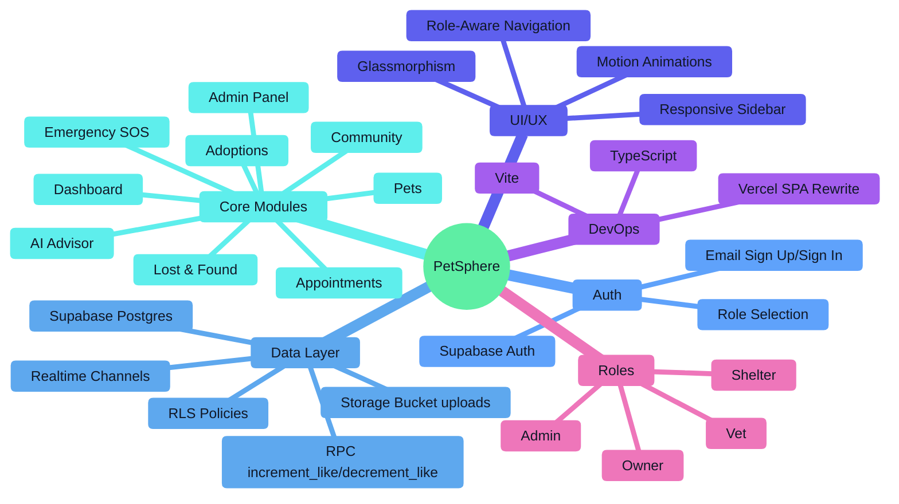
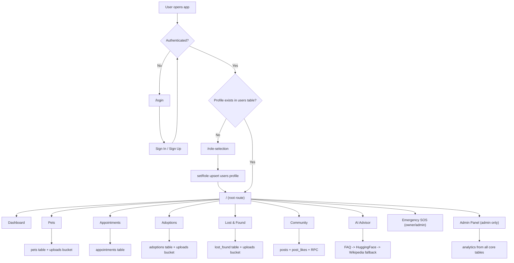
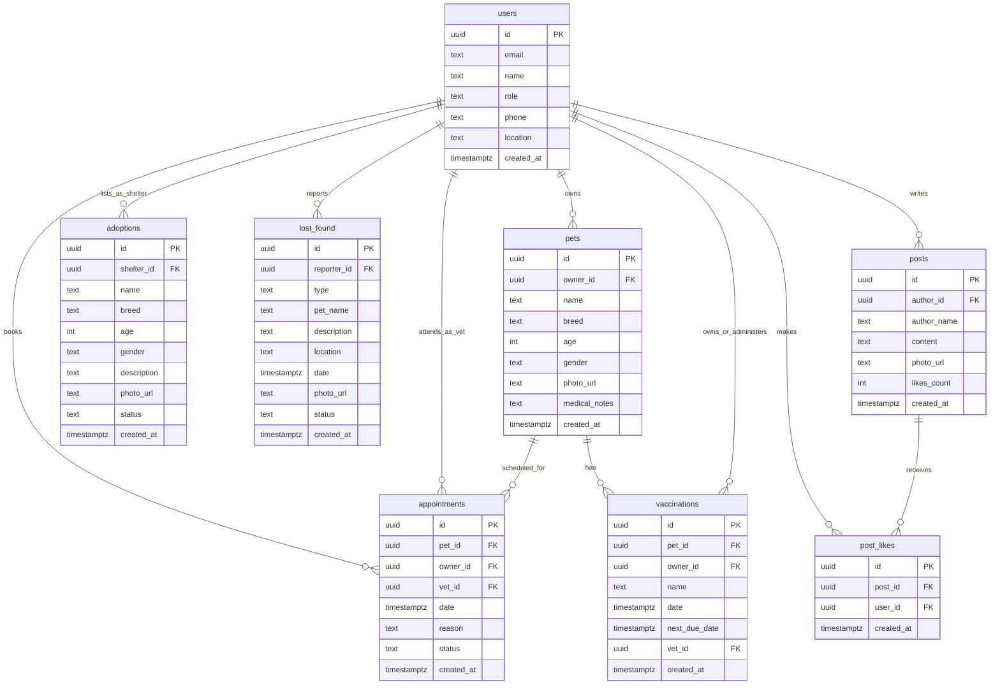
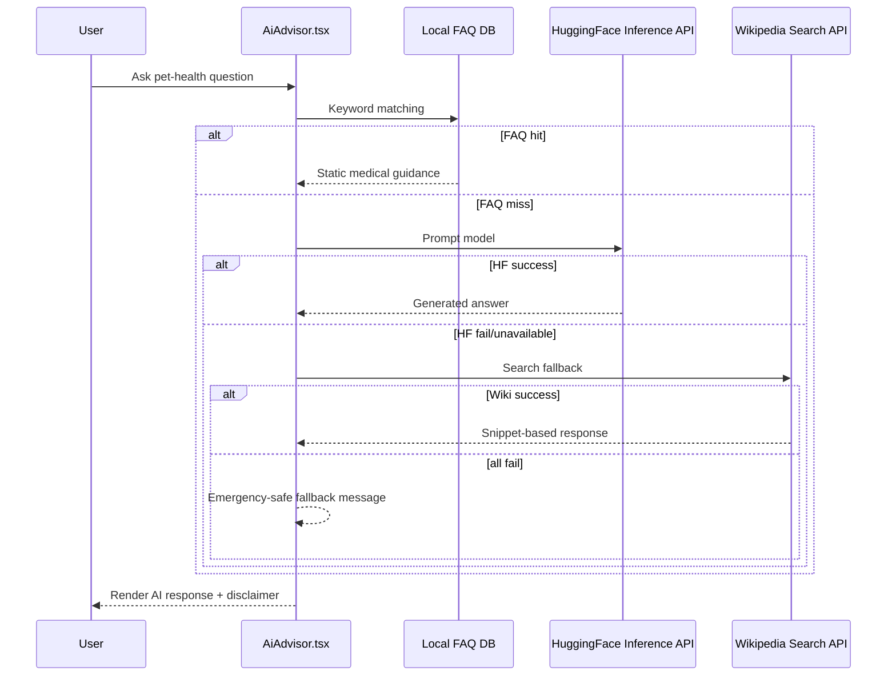

# PetSphere

A full-stack pet care platform built with React + Vite + Supabase that supports role-based workflows for:
- Pet Owners
- Veterinarians
- Animal Shelters
- Platform Admins

PetSphere combines pet profile management, vet appointments, adoptions, lost-and-found reporting, community posts, emergency vet discovery, and an AI pet advisor into one application.

## Project Overview

PetSphere is a role-aware web application with a modern animated UI and Supabase backend.

At a high level, the app provides:
- Authentication (email/password via Supabase Auth)
- Role onboarding (`owner`, `vet`, `shelter`, `admin`)
- Protected route system with profile-based access
- CRUD features across pet ecosystem modules
- Realtime UI updates using Supabase Realtime channels
- Storage-backed media uploads (pets, adoptions, posts, lost/found)

## Core Features

1. Authentication and role selection
2. Owner pet management (add pets with cropped photos)
3. Appointment booking and vet-side status updates
4. Shelter adoption listings and owner adoption requests UI
5. Lost & found reporting and "mark as found" workflow
6. Community feed with likes and optimistic-like behavior
7. Emergency view with nearby vets and map display
8. AI advisor with 3-tier response fallback
9. Admin analytics and moderation console

## Role Capabilities Matrix

| Module | Owner | Vet | Shelter | Admin |
|---|---|---|---|---|
| Login/Signup | Yes | Yes | Yes | Yes |
| Role Selection | Yes | Yes | Yes | (created in DB/profile) |
| Dashboard | Owner cards | Vet cards | Shelter cards | Analytics cards + chart |
| Pets | Manage own pets | View patients | No | Via DB/admin visibility |
| Appointments | Book + view own | View assigned + approve/reject | No | Read/update by RLS |
| Adoptions | Browse + request UI | Browse | Create/manage listings | Browse/manage by policy |
| Lost & Found | Report + mark found | Report + mark found | Report + mark found | Full visibility |
| Community | Create/like posts | Create/like posts | Create/like posts | Create/like + delete in admin |
| Emergency | Access | Hidden in nav | Hidden in nav | Access |
| Admin Panel | No | No | No | Full access |

## Architecture

- Frontend: React 19 + TypeScript + Vite
- Styling: Tailwind CSS v4 + custom design tokens in `src/index.css`
- State/Auth: Context API (`AuthContext`)
- Routing: `react-router-dom` with protected nested layout
- Backend: Supabase (Postgres + Auth + Storage + Realtime + RPC)
- Data transport: Supabase JS client
- Charts: `recharts`
- Map: `react-leaflet` + OpenStreetMap tiles
- Motion: `motion` (Framer Motion package split)

## Mindmap



## Application Flow (Mermaid)



## Database ER Diagram (Mermaid)



## AI Advisor Message Pipeline (Mermaid)



## Tech Stack

### Frontend
- React 19
- TypeScript
- Vite 6
- React Router 7
- Tailwind CSS 4
- Motion (`motion/react`)
- Recharts
- React Leaflet + Leaflet
- Lucide icons
- date-fns

### Backend / Platform
- Supabase Auth
- Supabase Postgres
- Supabase Storage (`uploads` bucket)
- Supabase Realtime
- Supabase RPC functions for atomic likes

## Repository Structure

```text
Petsphere/
├─ public/
├─ src/
│  ├─ components/
│  │  ├─ ImageCropper.tsx
│  │  └─ Layout.tsx
│  ├─ contexts/
│  │  └─ AuthContext.tsx
│  ├─ pages/
│  │  ├─ AdminPanel.tsx
│  │  ├─ Adoptions.tsx
│  │  ├─ AiAdvisor.tsx
│  │  ├─ Appointments.tsx
│  │  ├─ Community.tsx
│  │  ├─ Dashboard.tsx
│  │  ├─ Emergency.tsx
│  │  ├─ Login.tsx
│  │  ├─ LostFound.tsx
│  │  ├─ Pets.tsx
│  │  └─ RoleSelection.tsx
│  ├─ App.tsx
│  ├─ main.tsx
│  ├─ supabase.ts
│  └─ index.css
├─ supabase-schema.sql
├─ vite.config.ts
├─ tsconfig.json
├─ vercel.json
└─ README.md
```

## Environment Variables

Create `.env.local` in project root:

```bash
VITE_SUPABASE_URL="https://your-project-id.supabase.co"
VITE_SUPABASE_ANON_KEY="your-anon-key"

# Optional (currently not consumed directly in AiAdvisor.tsx request path)
GEMINI_API_KEY="your-gemini-key"
```

Notes:
- `src/supabase.ts` throws immediately if `VITE_SUPABASE_URL` or `VITE_SUPABASE_ANON_KEY` are missing.
- `GEMINI_API_KEY` is injected in `vite.config.ts` as `process.env.GEMINI_API_KEY`, but AI advisor currently uses HuggingFace + Wikipedia APIs.

## Supabase Setup

1. Create a Supabase project.
2. Open SQL Editor and run `supabase-schema.sql`.
3. Ensure Storage bucket named `uploads` exists (public access depending on your policy strategy).
4. Verify RLS policies are created as defined in schema file.
5. Add project URL and anon key to `.env.local`.

## Local Development

```bash
npm install
npm run dev
```

App runs at:
- `http://localhost:3000`

## Scripts

- `npm run dev` -> start Vite dev server on port 3000
- `npm run build` -> production build
- `npm run preview` -> preview production build
- `npm run clean` -> remove `dist`
- `npm run lint` -> type-check via `tsc --noEmit`

## Routing Map

| Route | Access | Purpose |
|---|---|---|
| `/login` | Public | Auth entry (sign in/sign up) |
| `/role-selection` | Authenticated without profile | Role onboarding |
| `/` | Authenticated + profile | Role-specific dashboard |
| `/pets` | Owner/Vet (via nav roles) | Pet records / patients |
| `/appointments` | Owner/Vet | Booking + status management |
| `/adoptions` | Owner/Shelter/Admin | Adoption listings |
| `/lost-found` | Owner/Shelter/Admin | Lost pet reporting |
| `/community` | All roles | Social feed |
| `/ai-advisor` | All roles | AI guidance chat |
| `/emergency` | Owner/Admin | Emergency vet map/list |
| `/admin` | Admin only | Platform analytics/moderation |

## Feature Deep Dive

### 1. Authentication & Profile Bootstrapping
- `AuthContext` initializes session via `supabase.auth.getSession()`.
- User profile is fetched from `users` table.
- Protected routes redirect based on state:
  - unauthenticated -> `/login`
  - authenticated without profile -> `/role-selection`
  - authenticated with profile -> app routes

### 2. Pets Module
- Owners can create pets with image upload.
- Image preprocessing uses `ImageCropper` (1:1 crop on canvas, exported jpeg).
- Realtime subscription refreshes list on DB changes.

### 3. Appointments Module
- Owners book appointments with selected pet + vet.
- Vets can confirm/cancel pending appointments.
- Status badges: `pending`, `confirmed`, `cancelled`, `completed`.

### 4. Adoptions Module
- Shelters create adoption listings with media.
- Owners can view and trigger request UI action.
- Realtime updates keep listings synced.

### 5. Lost & Found Module
- Users create lost pet reports (photo, date, location, description).
- Community users can mark a report as found with contact message.
- Found update is appended to description and status becomes `resolved`.

### 6. Community Module
- Users post text + optional image.
- Likes tracked in `post_likes` junction table.
- `increment_like` / `decrement_like` RPC keeps `likes_count` consistent.

### 7. Emergency Module
- Fetches users with `vet` role and displays on map/list.
- Current code seeds user location to static coordinates for demo behavior.

### 8. AI Advisor Module
- Tiered response engine:
  1. local FAQ keyword match
  2. HuggingFace generation endpoint
  3. Wikipedia search snippet fallback
- Includes medical disclaimer in UI.

### 9. Admin Panel
- Tabs: Overview, Users, Posts, Appointments, Adoptions, Lost & Found.
- Uses aggregate counts and charts for platform analytics.
- Includes post moderation (delete action).

## Security Model

- Supabase Auth for identity
- RLS enabled on all core tables
- Policy highlights:
  - `users`: read all authenticated, write own profile
  - `pets`: owners manage own pets
  - `appointments`: visible to owner/vet/admin, owners insert
  - `adoptions` and `posts`: public read
  - `post_likes`: unique `(post_id, user_id)` prevents double likes

## Realtime Behavior

Realtime subscriptions are enabled for:
- `pets`
- `appointments`
- `adoptions`
- `lost_found`
- `posts`
- `post_likes` (enabled in SQL publication)

Modules listening to realtime updates immediately refetch and re-render.

## Deployment

The project includes `vercel.json` rewrite config for SPA routing:

```json
{
  "rewrites": [
    { "source": "/(.*)", "destination": "/index.html" }
  ]
}
```

Build command:

```bash
npm run build
```

## Known Gaps / Notes

- AI Advisor header says "Powered by Gemini AI", but runtime path uses local FAQ + HuggingFace + Wikipedia fallback.
- `GEMINI_API_KEY` is defined in env examples/vite define, but not actively used by current AI module.
- Emergency map uses static user coordinates (`[37.7749, -122.4194]`) and synthetic vet marker offsets.
- Some legacy CRA files (`App.js`, `index.js`, tests) remain in repo but primary app entry is Vite + `src/main.tsx`.
- `package.json` includes some dependencies not currently used in active source path (`express`, `better-sqlite3`, `@google/genai`, etc.).

## Team & Contributors

### Core Team

| Avatar | Name | GitHub |
|---|---|---|
|  | K Rajtilak | [@rajtilak-2020](https://github.com/rajtilak-2020) |
|  | Jasmine Kaur | [@Jasminekaur-ux](https://github.com/Jasminekaur-ux) |
|  | Chinmay Gabhne | [@chinmaygabhne](https://github.com/chinmaygabhne) |
|  | Ayushman Das | [@i-u-shh-man](https://github.com/i-u-shh-man) |
|  | Nidhi Singh | [@nidhisingh9876](https://github.com/nidhisingh9876) |

---
